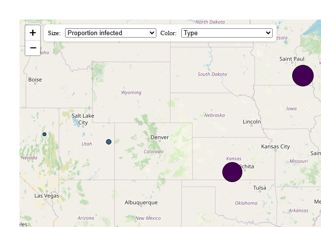
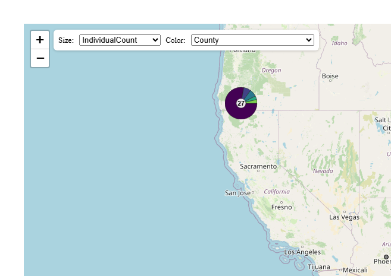

# metaMapWidget: R Wrapper for the meta-map-widget Leaflet widget

This package allows users to view the locations of custom data samples
and their various attributes using an interactive map widget. The widget
may be embedded in Rmd/Quarto documents.

## Installation

For now, metaMapWidgetR is only available on Github and can be installed
with devtools:

``` r
devtools::install_github('grunwaldlab/metaMapWidgetR')
```

## Quick start

This package includes multiple example data sets that are automatically
loaded with the package. After installation, simply run the lines below
to test randomly generated data and customized test columns:

``` r
library(metaMapWidgetR)

example_data_path <- system.file('extdata', 'data.csv', package = 'metaMapWidgetR')

meta_map_widget(example_data_path)
```

<!-- -->

Or, to get an idea of how this would work with real data:

``` r
library(rgbif)
occ_data <- occ_search(scientificName = "Bombus franklini")
occ_table <- occ_data$data
occ_table$latitude <- occ_table$decimalLatitude
occ_table$longitude <- occ_table$decimalLongitude
meta_map_widget(occ_table, sizeVar='individualCount', colorVar='county')
```

<!-- -->
